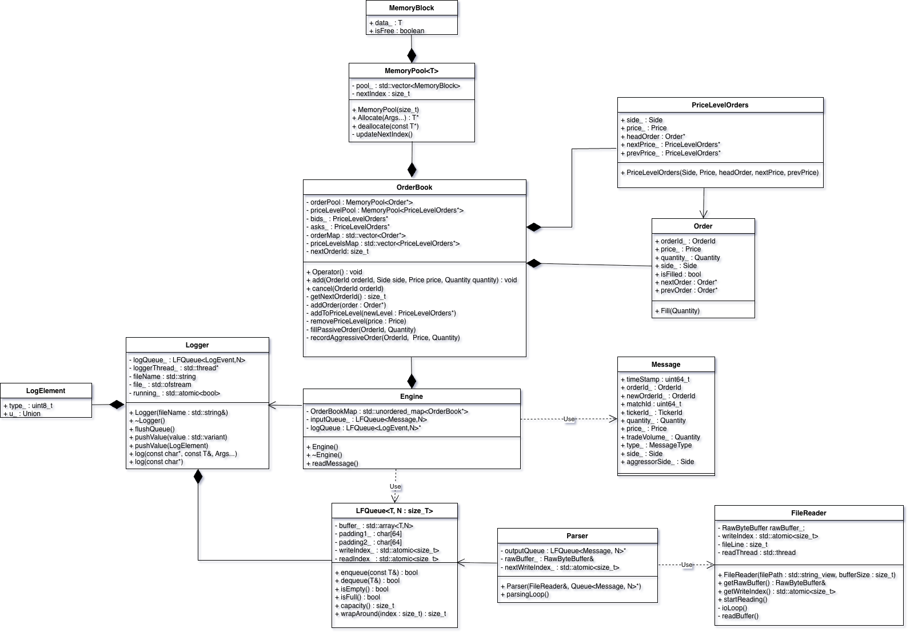

## Description
This project aims to have achieved extremely high-performance ITCH orderbook, able to dissemenate 9.6 Million Nasdaq messages/second. Much of this project was inspired by David gross talks on low-latency applications which I have listed below. 


## Building and Running the program
In order to build and run the application, I have included a shell script which will run a few buildsystem commands in order to build our application.
1.  Clone the repository:
    ```bash
    git clone https://github.com/lhickey87/OrderBook.git
    ```
2. Run the Build Script from Project Root
```bash
cd OrderBook
./build.sh
```

3. Run the Application Binary
```bash
./build/src/orderbook 
```


## Discussion
I have linked two David Gross talks below which were significant inspirations when designing my low-latency orderbook. In these talks he shows that whilst Node containers like std::map can have more desirable worst-case time complexities, when building a low-latency
application such as an orderbook these data structures are not optimal primarily because they have very poor cache locality and even th ough we may be performing less operations, the cost of cache misses result in performance decline. Whilst more cache friendly data structures like std::vector have a less desirable worst-case time complexity for adding and removing, his
benchmarks show that the performance gained from avoiding cache-misses outweighs potentially having to do more operations.

In order to squeeze as much performance as possible out of every component in the program, I focused on the following:
1. Avoid system call overhead from constantly allocation new memory on the heap, we will use a memory pool in order to avoid this reccuring overhead
2. Avoiding Node containers, vowing to use more cache-friendly data structures (std::vector or std::unique_ptr<T[]>)
3. Ensuring that our hot path (Engine and Orderbook) 


## UML Design Overview


## Relevant Materials
- [When Nanoseconds Matter: Ultrafast Trading Systems in C++ - David Gross - CppCon 2024](https://www.youtube.com/watch?v=sX2nF1fW7kI&t=1994s)
- [Trading at light speed: designing low latency systems in C++ - David Gross - Meeting C++ 2022](https://www.youtube.com/watch?v=8uAW5FQtcvE&t=1854s)
- [An Introduction to Limit Order Books](https://www.machow.ski/posts/2021-07-18-introduction-to-limit-order-books/#ordertypes)
